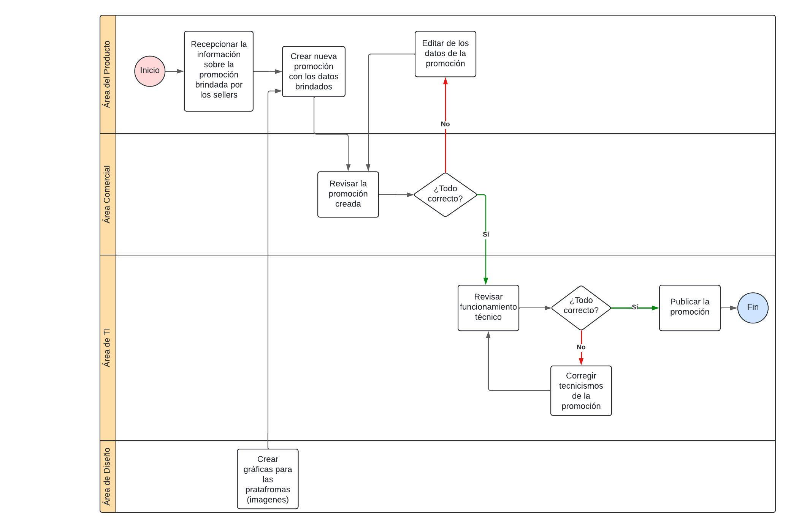

# 1.3. Procesos de Negocio identificados
# *1. Módulo de Gestión de Promociones*

|Actividad | Descripción | Responsable|
|----------------------------------------|-----------------------------------------------|----------------------------------------------------------------------------|
|Recepcionar la información sobre la promoción brindada por Sellers| Recoger los detalles de la promoción proporcionados por el equipo de vendedores, asegurándose de obtener toda la información relevante.| Equipo de Producto |
|Crear nueva promoción con los datos brindados| Utilizar la información recibida para configurar una nueva promoción en el sistema, ingresando los datos correspondientes. | Equipo de Producto |
|Editar los datos de la promoción|Realizar cambios o ajustes en los datos de la promoción ya creada, según sea necesario.| Equipo de Producto |
|Revisar la promoción creada| Verificar la precisión y la correcta configuración de la promoción para asegurar que todos los datos sean correctos.| Equipo Comercial |
|Revisar funcionamiento técnico| Comprobar que la promoción funcione correctamente en el sistema y que no haya errores técnicos. | Equipo de TI |
|Publicar la promoción| Hacer efectiva la promoción, asegurando que esté disponible para los usuarios finales en las plataformas correspondientes. | Equipo de TI |
|Corregir tecnicismo de la promoción| Solucionar cualquier problema técnico o errores detectados durante la revisión o funcionamiento de la promoción. | Equipo de TI |
|Crear gráficas para las plataformas (imágenes)| Diseñar y crear imágenes o gráficos necesarios para la promoción, adaptados a las diferentes plataformas donde se publicará.| Equipo de Diseño |

# *2. Módulo de Gestión de Campañas Publicitarias*

| Actividad                         | Descripción            | Responsable |
|--------------------------------------|---------------------------------------------------------------------------------------------------------------------------------------------------------|---------------------|
| **Definición de objetivos de la campaña** | Establecer los objetivos de la campaña (incremento de descargas, aumento de transacciones, uso de promociones).                              | Equipo de Marketing       |
| **Planificación de la campaña**           | Diseño de la estrategia publicitaria, selección de canales (redes sociales, TV, radio, app, etc.), segmentación del público y presupuesto.   | Equipo de Marketing       |
| **Creación de contenido publicitario**    | Desarrollo de los materiales gráficos, videos, banners, notificaciones push, entre otros, necesarios para la campaña.                        | Equipo de Diseño        |
| **Aprobación de la campaña**              | Revisión y aprobación final de la campaña antes de su ejecución, evaluando si se ajusta a los objetivos y presupuesto.                       | Equipo de Marketing       |            |
| **Lanzamiento de la campaña**        | Ejecución de la campaña en los diferentes medios seleccionados, como redes sociales, notificaciones push y otros.                                 | Equipo de Marketing       |
| **Monitoreo y ajustes**              | Seguimiento del rendimiento de la campaña en tiempo real, analizando métricas clave como impresiones, CTR y conversiones. Realización de ajustes si es necesario. | Equipo de Marketing                  |
| **Evaluación post-campaña**          | Recolección de datos finales y generación de informes para medir el éxito de la campaña en relación con los objetivos planteados.                  | Equipo de Marketing      |

# *3. Módulo de Gestión Integral de Reclutamiento y Selección*
## 3.1. Proceso para la Gestión de Nuevas Vacantes

| Nro | Actividad                                | Descripción                                                                 | Responsable                  |
|-----|------------------------------------------|-----------------------------------------------------------------------------|------------------------------|
| 1   | Identificación de necesidad de un puesto | Se identifica la necesidad de crear un nuevo puesto en la organización.      | Gerencia de Planeamiento      |
| 2   | Análisis del puesto                      | Se realiza un análisis del nuevo puesto solicitado.                         | Departamento de Contratación  |
| 3   | Definición del puesto                    | Se detallan las responsabilidades y requerimientos del puesto.              | Departamento de Contratación  |
| 4   | Aprobación interna del puesto            | Se aprueba el puesto internamente en la organización.                       | Departamento de Contratación  |
| 5   | Creación de la vacante en el sistema     | Se ingresa la información del puesto en el sistema de gestión de vacantes.  | Departamento de Contratación  |
| 6   | Apertura de la vacante                   | Se publica la vacante para iniciar el proceso de reclutamiento.             | Departamento de Contratación  |
| 7   | Monitoreo de aplicación                  | Se monitorean las postulaciones recibidas para el puesto.                   | Departamento de Contratación  |
| 8   | Revisión del puesto y ajustes            | Se revisa y ajusta la descripción del puesto si es necesario.               | Departamento de Contratación  |
| 9  | Cierre de la vacante                     | Se cierra la vacante una vez cubierta.                                      | Departamento de Contratación  |
| 10  | Comunicación sobre el puesto             | Se comunica el estado del puesto al área correspondiente.                   | Departamento de contratación              |

## 3.2. Proceso para Reclutamiento y Selección

| Nro | Actividad                                | Descripción                                                                 | Responsable                  |
|-----|------------------------------------------|-----------------------------------------------------------------------------|------------------------------|
| 1   | Publicación de vacante                   | Se publica la vacante en los medios adecuados.                              | Departamento de Comunicación  |
| 2   | Envío de aplicación                      | Los candidatos envían sus aplicaciones a la vacante.                        | Candidato                    |
| 3   | Recepción de aplicaciones                | Se reciben y almacenan las aplicaciones de los candidatos.                  | Departamento de Contratación  |
| 4   | Filtro inicial                           | Se realiza un primer filtro de los candidatos basándose en los requisitos.  | Departamento de Contratación  |
| 5   | Entrevista inicial                       | Se entrevista a los candidatos que pasaron el primer filtro.                | Departamento de Contratación  |
| 6   | Entrevista técnica                       | Se realizan entrevistas técnicas a los candidatos seleccionados.            | Departamento de Contratación  |
| 7   | Evaluación psicológica                   | Se aplica una evaluación psicológica a los candidatos.                      | Departamento de Contratación  |
| 8   | Revisión final del candidato             | Se revisa el perfil completo de los candidatos para la decisión final.      | Departamento de Contratación  |
| 9   | Selección de candidato                   | Se selecciona al candidato que mejor se ajuste al perfil del puesto.        | Departamento de Contratación  |
| 10  | Comprobación de referencias y antecedentes| Se comprueban las referencias y antecedentes del candidato seleccionado.    | Departamento de Contratación  |
| 11  | Creación y aprobación de oferta laboral  | Se crea la oferta laboral para el candidato seleccionado.                   | Departamento de Contratación  |
| 12  | Comunicación al candidato                | Se comunica al candidato la oferta de trabajo.                              | Departamento de Contratación  |

## 3.3. Proceso de Contratación

| Nro | Actividad                                | Descripción                                                                 | Responsable                  |
|-----|------------------------------------------|-----------------------------------------------------------------------------|------------------------------|
| 1   | Preparación del contrato de trabajo      | Se prepara el contrato para el nuevo empleado.                              | Departamento de Contratación  |
| 2   | Envío del contrato                       | Se envía el contrato al candidato para su revisión.                         | Departamento de Contratación  |
| 3   | Revisión de documentación                | Se revisa la documentación proporcionada por el candidato.                  | Candidato                    |
| 4   | ¿Acepta?                                 | Se toma la decisión de aceptar o no el contrato.                            | Candidato                    |
| 5   | Subir documentación                      | Si el candidato acepta, sube la documentación necesaria.                    | Candidato                    |
| 6   | Registro del nuevo empleado al sistema   | Se registra al nuevo empleado en el sistema interno de la empresa.          | Departamento de Contratación  |
| 7   | Notificación al área solicitante         | Se notifica al área solicitante sobre la incorporación del nuevo empleado.  | Departamento de Contratación  |

# *4. Módulo de Gestión de Tipificaciones de Interacciones con CRM*
Este proceso cubre todo el flujo desde la recepción del problema hasta la mejora de atención al cliente. Clasifica automáticamente las interacciones con clientes, asigna categorías precisas y registra la información en el CRM. También permite ajustes manuales con la interaccion con los asesores, análisis de problemas recurrentes y retroalimentación continua para optimizar la atención al cliente y mejorar procesos internos.

| Nro | Actividad                                     | Descripción                                                                                                                 | Responsable                   |
|-----|-----------------------------------------------|-----------------------------------------------------------------------------------------------------------------------------|-------------------------------|
| 1   | Recepción de interacción                      | Se recibe la interacción desde algún canal (WhatsApp, chatbot, etc.).                                                       | Área de comunicación          |
| 2   | Análisis del chatbot                          | El chatbot analiza la interacción para determinar si puede resolver el problema automáticamente.                            | Chatbot (Automatización)      |
| 3   | Recepción de interacción no resuelta          | Si el chatbot no resuelve el problema, se deriva a la siguiente fase para su tratamiento manual.                            | Área comercial                |
| 4   | Revisión del contenido de la interacción      | Un asesor revisa manualmente el contenido de la interacción para comprender el problema del cliente.                        | Asesor de CRM                 |
| 5   | Asignación de tipificación automática         | El sistema de chatbot asigna una tipificación automática basada en reglas predefinidas.                                     | CRM (Automatización)          |
| 6   | Selección de tipificación manual              | Si la tipificación automática no es precisa, el asesor puede seleccionar la tipificación manualmente.                       | Asesor de CRM                 |
| 7   | Registro de la interacción en el CRM          | Se tipifica la interacción en el sistema CRM para su seguimiento y análisis del problema.                                   | Asesor de CRM                 |
| 8   | Monitoreo de la calidad de las tipificaciones | Se realiza un control de calidad para verificar si la tipificación asignada fue correcta.                                   | Supervisor de CRM             |
| 9   | Ajustes a los criterios de tipificación       | Si se identifica un error en la tipificación, se ajustan los criterios manuales para mejorar en futuras interacciones.      | Supervisor de CRM             |
| 10  | Análisis de problemas                         | Se analizan los problemas y patrones recurrentes detectados durante la gestión de interacciones.                            | Equipo de Data Analytics      |
| 11  | Identificación de problemas recurrentes       | Se identifican problemas recurrentes o comunes dentro de las interacciones registradas en el CRM.                           | Equipo de Customer Experience |
| 12  | Ajuste del chatbot                            | Si se identifican problemas que el chatbot podría resolver, se ajusta su programación para mejorar la respuesta automática. | Equipo de Desarrollo          |
| 13  | Implementación de tipificaciones              | Si se detectan nuevas categorías de problemas, se implementan nuevos criterios de tipificación en el CRM.                   | Equipo de Desarrollo de CRM   |
| 14  | Monitoreo de la experiencia                   | Se monitorea cómo los cambios en la tipificación afectan la experiencia del cliente con el CRM y la app.                    | Equipo de Customer Experience |

# *5. Módulo de Gestión de Empleados*
Este proceso abarca desde la inducción inicial del empleado, pasando por la capacitación inicial, la creación de su perfil en el sistema, y la actualización de datos. Incluye también la gestión de asistencias, la solicitud y aprobación de permisos, y la asignación de proyectos según el perfil del empleado. A lo largo de la relación laboral, se realizan evaluaciones de desempeño, se generan reportes que son revisados por la gerencia, y se fomenta la capacitación continua para el desarrollo del empleado. El proceso cierra con la finalización del contrato cuando corresponde, o la actualización de datos en caso de cambios de rol o promoción.

| Nro | Actividad                                | Descripción                                                                 | Responsable                  |
|-----|------------------------------------------|-----------------------------------------------------------------------------|------------------------------|
| 1   | Proceso de Inducción (Onboarding)       | Se proporciona información inicial sobre la cultura de la empresa, políticas y beneficios. | Departamento de Gestión RRHH  |
| 2   | Capacitación inicial                     | Se realizan sesiones de capacitación para instruir sobre las herramientas y procesos internos. | RRHH/Equipo de Capacitación   |
| 3   | Creación de perfil de empleado           | Se registra el perfil completo del nuevo empleado en el sistema, incluyendo datos personales y profesionales. | Equipo TI                    |
| 4   | Actualización de datos                   | El empleado puede actualizar sus datos personales y profesionales a través del sistema. | Equipo TI                    |
| 5   | Asignación de proyectos                  | El empleado es asignado a uno o varios proyectos en función de su perfil y habilidades. | Líder de Proyectos           |
| 6   | Seguimiento de proyectos                 | Se monitorea la participación y contribución del empleado en los proyectos asignados. | Líder de Proyecto            |
| 7   | Registro de asistencia                   | El sistema registra diariamente la asistencia, turnos y ausencias del empleado. | Colaborador                  |
| 8   | Solicitud de permisos o licencias        | El empleado realiza solicitudes de permisos o licencias a través del sistema, indicando el motivo y fechas. | Colaborador                  |
| 9   | Aprobación de permisos o licencias       | La solicitud es revisada por el supervisor o RRHH y se aprueba o rechaza según las políticas de la empresa. | Departamento de Gestión      |
| 10  | Desarrollo y Ejecución de labores        | El empleado continúa con sus tareas laborales diarias de forma regular si la solicitud de permiso no es aprobada. | Colaborador                  |
| 11  | Evaluación del desempeño                 | Se llevan a cabo evaluaciones periódicas del desempeño, considerando proyectos, habilidades y contribuciones. | Supervisor Departamento de Gestión RRHH |
| 12  | Generación de reportes de desempeño      | Se generan reportes sobre el desempeño individual del empleado, usados para la toma de decisiones gerenciales. | Supervisor Departamento de Gestión RRHH |
| 13  | Capacitación continua                    | Se supervisa y organiza la participación en capacitaciones adicionales para mejorar las habilidades del empleado. | RRHH/Equipo de Capacitación   |
| 14  | Asignación de beneficios                 | Se asignan beneficios como seguros, bonos o programas de bienestar según el perfil del empleado y políticas de la empresa. | Equipo de Finanzas           |
| 15  | Generación de reportes gerenciales       | Se crean reportes generales para la alta dirección, basados en los indicadores clave del personal. | Gerencia Departamento de Gestión |
| 16  | Revisión y ajuste de beneficios          | Periódicamente se revisan los beneficios del empleado, ajustándolos si es necesario. | Equipo de Finanzas           |
| 17  | Revisión de cumplimiento de políticas    | Se verifica que el empleado cumpla con las políticas internas de la empresa y las normativas legales. | Departamento de Gestión RRHH  |
| 18  | Finalización de la relación laboral (si aplica) | En caso de retiro o promoción, se realiza la gestión adecuada del fin de la relación laboral o del nuevo puesto. | Supervisor Dto. de Gestión   |

# *6. Módulo de Gestión de Incidentes*

| Actividad                         | Descripción            | Responsable |
|--------------------------------------|---------------------------------------------------------------------------------------------------------------------------------------------------------|---------------------|
| **Registrar incidente**              |  Se registra el incidente apenas se reciba la primera notificación, incluyendo toda la informacion relevante  | Cliente  |
| **Clasificar y asignar tecnico**     |  Se asignan atributos al incidente, categoria, subcategoria   |  Lider área de TI  |
| **Incidente en curso**       |  Se evalua si ya se esta trabajando en el mismo incidente  | Área de TI  |
| **Indicar estado**        | Se comunica al cliente si se reporto el mismo incidente |  Área de TI  |
| **Asociar ticket**            |  Se informa al cliente el ticket original vinculado  |   Área de TI   |
| **Enviar la resolucion del incidente en curso**   |  Se envia la documentacion respecto al incidente en curso  |  Área de TI  |
| **Comunicar incidente crítico**    |  Si se determina que el incidente es crítico, se notifica al equipo de dirección  |   Area de TI   |
| **Realizar diagnostico**          |  Se realiza un análisis e investigación del incidente a partir de la información registrada  |  Area de TI  |
| **Diagnostica y aplica solución**      |  Si el problema proviene de un proveedor, este debe realizar un diagnostico y aplicar una solución al problema  |    Proveedores  |
| **Aplica solución**        |  En base al diagnostico, se brinda soporte inicial con el fin de restablecer el servicio a su estado normal  |  Area de TI  |
| **Verificar solución**     |  Se verifican los resultados de la solución  | Area de TI |
| **Validar con el cliente**      |  Se espera la aprobación del Cliente  |  Cliente  |
| **Abrir ticket problema y cerrar incidente**    |  En caso el incidente sea crítico y/o reincidente, se clasifica como ticket problema  |  Lider área TI |
| **Cerrar ticket**      |  Cuando el incidente haya sido resuelto, se podrá dar por finalizado el ticket  |  Lider area de TI  |

# *7. Módulo de Gestión de Capacitaciones*
El módulo abarca la identificación de necesidades de capacitación para empleados nuevos, la creación de una capacitación con módulos y un test final, asegurando una preparación básica para los nuevos empleados.

| **Actividad**                                 | **Descripción**                                                                  | **Responsable**               |
|-----------------------------------------------|----------------------------------------------------------------------------------|-------------------------------|
| **Identificar necesidades de capacitación**    | Identificar necesidades de capacitación para empleados nuevos.                   | Departamento de Gestión       |
| **Procesar solicitudes de capacitación**      | Procesar las solicitudes de capacitaciones.                                    | Departamento de Gestión       |
| **Crear capacitación, módulos y examen**              | Crear capacitaciones que incluyen módulos de contenido específicos, así como un examen.             | Área de Capacitación          |
| **Asignar capacitación a empleados**          | Asignar la capacitación a los empleados que la necesitan.                       | Departamento de Gestión       |
| **Realizar capacitación**                     | Llevar a cabo toda la capacitación.                                                  | Área de Capacitación          |
| **Recibir retroalimentación**                 | Recoger retroalimentación sobre la capacitación realizada.                      | Área de Capacitación          |
| **Evaluar resultados**                        | Evaluar los resultados de la capacitación realizada.               | Departamento de Gestión       |
