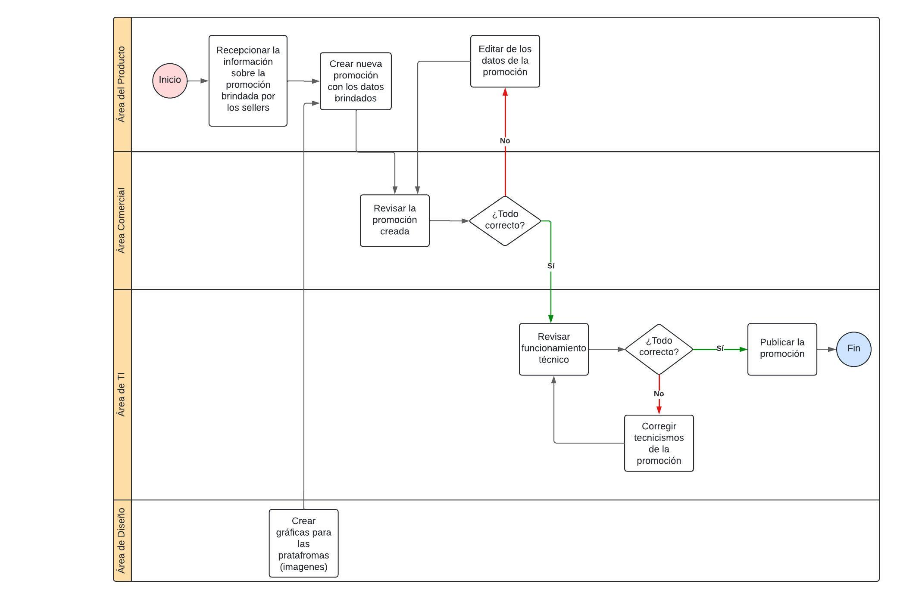

# 2.1. Procesos AS-IS
## 1. Módulo de Gestión de Promociones

## 2. Módulo de Campañas Publicitarias

## 3. Módulo de Gestión Integral de Reclutamiento y Selección

## 4. Módulo de Gestión de Tipificaciones de Interacciones con CRM

## 5. Módulo de Gestión de Empleados

## 6. Módulo de Gestión de Incidentes

## 7. Módulo de Gestión de Comercios

