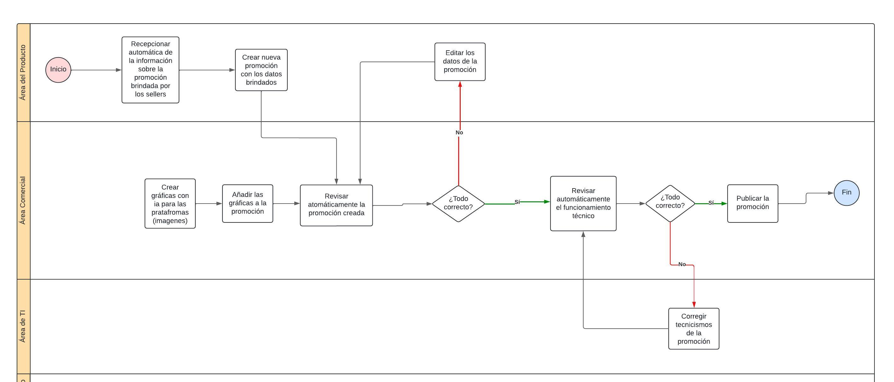

# 2.2. Procesos TO-BE
## 1. Módulo de Gestión de Promociones

Cambios para mejora del módulo:
Ahora se automatizan la recepción de información, la revisión de la promoción y el funcionamiento técnico, lo que antes se hacía manualmente. Además, la creación de gráficas para las plataformas se optimiza mediante inteligencia artificial, eliminando la intervención manual del área de diseño. 

## 2. Módulo de Gestion de Campaña Publicitaria

Cambios para mejora del módulo:
Se hizo el añadido de un proceso el cual es el Pre-Testing que permitira a Yape a segmentar de manera más eficiente las publicidad, en este procesos se enviara un prototipo de una publicidad a pequeños grupos de usuarios divididos por edad u otro requerimientos. Con esto se reducira el riesgo de perdidas monetarias significativas al hacer una publicidad completa que no haya sido correctamente segmentada, ademas se cuidara la imagen de la empresa ante los socios comerciales que permitiran la difusion de la publicidad.  

## 3. Módulo de Gestión Integral de Reclutamiento y Selección

Cambios para mejora del módulo:
Actualmente no hay procesos que registren y envíen el feedback al candidato. Por ello, se agrega un proceso el cual almacene los feedback de cada entrevista y que permita el posterior envío de estos al candidato sea aprobado o no. Esto es especialmente importante para mantener una buena imagen corporativa, ya que una experiencia positiva puede influir en futuras postulaciones o recomendaciones.

## 4. Modúlo de Gestión de Tipificaciones de Interacciones con CRM

Cambios para mejora del modúlo: 
- Se añadió el proceso apoyo de asignación en las tipificaciones, que les permite a los asesores tener una mayor precisión al buscar la etiqueta que se adecue al problema del cliente mediante un motor de busqueda inteligente y como segunda opción la búsqueda por filtro que se adecuan al problema, además se agrega una definición de la tipificación.
- Se anadió el proceso de monitoreo de asignación de tipificaciones, permite que los analistas puedan apoyar a los asesores rectificando la mala asignación de las tipificaciones, además permite que los business puedan conocer los problemas más recurrente con mejor precisión.
- Se añadió un preprocesamiento automatización del entrenamiento del bot de Yape, permitiendole ajustar el modelo de manera mas eficiente ajustando los hiperparametros facilmente.
- Por ultimo se añadió dos procesos de los reporte automatizados que permite a los analistas y business mejorar el nivel de experiencia de los clientes.

## 5. Módulo de Gestión de Empleados

Cambios para mejora del modulo: 
Actualemente no hay procesos que registren y envíen la retroalimentación al empleado. Por ello, se agrega un proceso de retroalimentación periódica, en el cual se almacene y gestione el feedback sobre el desempeño, asistencia y contribución del empleado en proyectos. Esto permitirá que los empleados reciban comentarios continuos para mejorar sus habilidades y ajustar su rendimiento. Asimismo se incorpora un proceso que mantiene un registro detallado del historial del empleado desde su ingreso hasta el presente, incluyendo desempeño, asistencias, cambios de rol y capacitaciones. Este registro facilita una mejor gestión de recursos humanos y proporciona una visión clara del desarrollo del empleado, permitiendo ajustes en beneficios, promociones o nuevas asignaciones de proyectos.

## 6. Módulo de Gestion de Incidentes

Cambios para mejora del modulo:
- Automatizar la creacion de un ticket, ya no requerirá de la aprobacion del lider del grupo.
- Se procede con una validación automatica, si se excede un tiempo para realizarla. 

## 7. Módulo de Gestión de Capacitaciones

Cambios para mejora del modulo: 
- Capacitación a empleados en general: Se implementará la capacitación para empleados en general, asegurando que también reciban formación en habilidades actualizadas o específicas. Las habilidades necesitadas por los empleados serán previamente identificadas por el área de TI.

- Evaluaciones progresivas: Se llevarán a cabo tests progresivos después de cada módulo de capacitación, permitiendo medir el desempeño de los empleados a lo largo del proceso de aprendizaje, y no solo tener un examen final.

## 8. Condensado de todos los módulos
