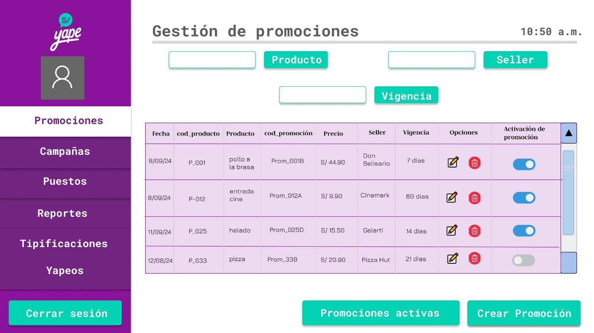
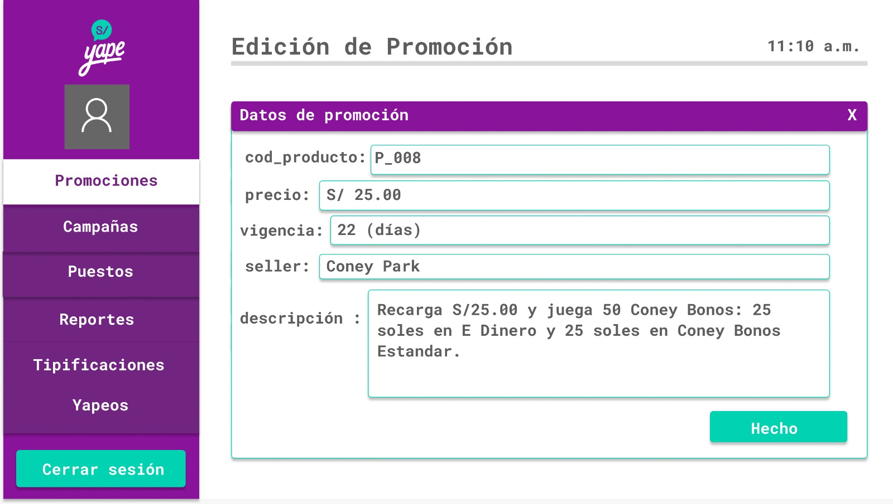
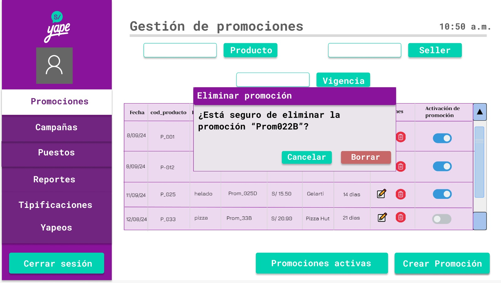

# 4.1. Módulo 1: Gestión de Promociones
## Caso de uso: Gestión de Promociones
 Descripción: Este caso de uso es iniciado por un trabajador (usuario).  Le entrega al trabajador la capacidad de crear, modificar, borrar y/o revisar las promociones activas, en tiempo real.

 Pre-condiciones: Ninguna

### Flujo principal

|**ACCIÓN DEL ACTOR** | **RESPUESTA DEL SISTEMA**|
|---------------------|----------------------|
| 1.- El trabajador ingresa su id y su contraseña. | 2.- El sistema verifica si es válido. |
| 3.- El trabajador selecciona en el sidebar "Promociones" | 4.- El sistema muestra una tabla con todas las promociones existentes, en la pantalla se muestra los botones "Crear promoción", "Promociones activas" y en las promociones existentes 2 botones con la forma de un lápiz (editar) y una basura (eliminar). |

### Flujo alternativos

**Modificar (editar) una promoción**

|**ACCIÓN DEL ACTOR** | **RESPUESTA DEL SISTEMA**|
|---------------------|----------------------|
|                     | 1.- La pantalla muestra la base de datos con todas las promociones existentes. |
|2.- El trabajador puede seleccionar una de los existentes y pulsar el botón de edición (lápiz) | 3.- El sistema le mostrará una pantalla donde aparecerán los datos de la promoción existente (cod_productos, precio, vigencia, seller, descripción) |
|4.- El trabajador puede seleccionar cual dato desea cambiar haciendo doble click. | 5.- El sistema valida la información ingresada. |
| 6.- El trabajador le da a "Hecho" | 7.- El sistema confirma la promoción. |

### 

*Prototipos (Pantallas)*

