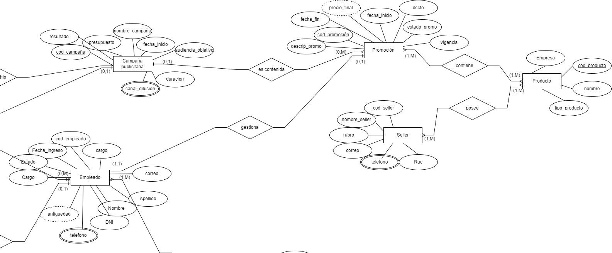

# 5.1. Diagrama Entidad Relación
### Diagrama Módulo de Gestión de Promociones

### Diagrama Modulo de Gestion de Campaña publicitaria

### Diagrama Modulo de Gestion de Empleados

### Diagrama Modulo de Gestión de Tipificaciones de Interacciones con CRM

### Diagrama Modulo de Gestion de Incidentes

## Diagrama Módilo Gestión de Comercios

